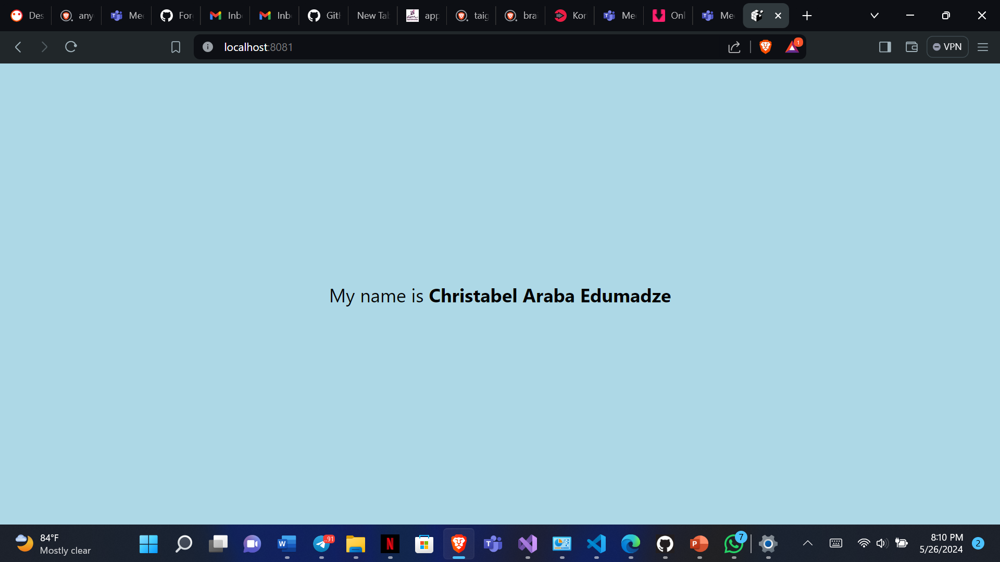

# rn Assignment 2

## Description
This project is a simple React Native application created using Expo CLI. It displays a text with my name in bold and a light blue background color.

## Task
- Change the background color of the `View` component.
- Edit the `Text` component to display "My name is Christabel Araba Edumadze".
- Increase the font size of the text to 24.
- Made the name "Christabel Araba Edumadze" bold.

## Student ID
11348914

